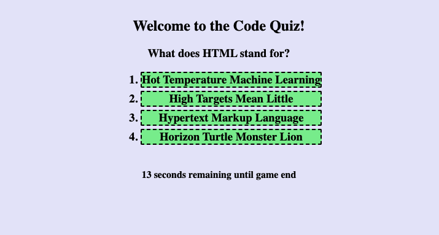

# Code-Quiz

This application is a brief quiz with some questions about coding and its history. It runs a timer, subtracts time from the clock if a wrong answer is selected, calculates the user's score, and lets the user save the score to a list of top scores. The best 3 scores are displayed after each round of the quiz.

## Link to Published Webpage

https://jcdoran33.github.io/Code-Quiz/

## Screenshot Image of Published Webpage

